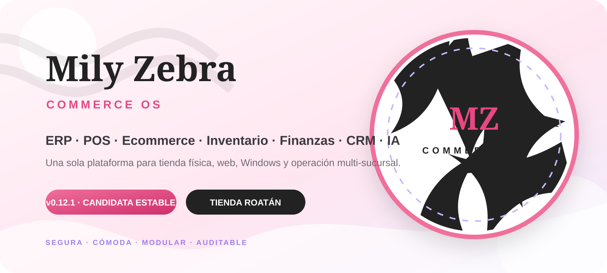

# Mily Zebra Commerce OS

<p align="center">
  
</p>

<p align="center">
  <strong>ERP modular · POS · Ecommerce · Inventario · Finanzas · CRM · Automatización · IA</strong><br />
  Tienda física, web, PWA y Windows sobre una sola plataforma y una sola fuente de verdad.
</p>

> [!IMPORTANT]
> **Estado actual: candidata a estable `v0.12.1`.** Todavía no es una release estable publicada. La rama `stabilize/v0.12.1` solo debe fusionarse a `main` cuando CI, Stable Gate, instalación limpia, migración desde la versión anterior, Chromium/PWA, backup→restore y builds Windows terminen completamente en verde.

## Qué es Mily Zebra

**Mily Zebra Commerce OS** es el sistema de comercio de Tienda Roatán / Mily Zebra. No es únicamente una caja ni una landing page: integra en un mismo producto la operación de tienda, ecommerce, inventario, clientes, administración, finanzas, automatización y experiencias asistidas por IA.

La arquitectura mantiene una sola lógica de negocio:

```text
                    ┌──────────────────────┐
                    │   Mily Zebra API     │
                    │ FastAPI + PostgreSQL │
                    └──────────┬───────────┘
                               │
              ┌────────────────┼────────────────┐
              │                │                │
       ┌──────▼──────┐  ┌──────▼──────┐  ┌─────▼─────────┐
       │ Storefront  │  │ /admin PWA  │  │ Workers/colas │
       │ Ecommerce   │  │ POS + ERP   │  │ automatización│
       └─────────────┘  └──────┬──────┘  └───────────────┘
                               │
                     ┌─────────▼─────────┐
                     │ MilyZebra.exe     │
                     │ WebView2/Chromium │
                     └─────────┬─────────┘
                               │
                     ┌─────────▼─────────┐
                     │ Hardware Agent    │
                     │ ESC/POS · ZPL     │
                     └───────────────────┘
```

`MilyZebra.exe` abre la misma aplicación web/PWA. Cajera, vendedor, bodega, gerencia y driver usan el mismo cliente; el backend determina su experiencia mediante login, tenant, sucursal, roles y permisos.

---

## Identidad visual del proyecto

La dirección visual aprobada del proyecto usa **rosa, lavanda, blanco y negro**, tipografía editorial, patrones zebra, la mascota femenina y una experiencia de moda con scroll y catálogo visual.

Los chats y entregas anteriores del proyecto documentan estas evidencias originales:

| Evidencia visual histórica | Uso previsto en el repositorio |
|---|---|
| Logo Mily Zebra | Marca, login, PWA, README |
| Mascota Mily Zebra | Landing, onboarding y comunicación de marca |
| Brand guide | Paleta, tipografías, componentes y tono visual |
| Landing hero desktop | Evidencia de storefront |
| Landing hero mobile | Evidencia responsive |
| Landing completa desktop | Validación de recorrido visual |
| Boutique 4 × 2 m | Referencia de operación y experiencia física |
| Catálogo de lanzamiento | Dirección de fotografía y merchandising |

> [!WARNING]
> **Deuda visual detectada:** esas fotografías y renders existían en paquetes anteriores (`frontend/public/brand/` y `docs/design-reference/`), pero sus binarios no están hoy en el árbol Git actual. No se colocan enlaces rotos ni se inventan nuevas fotografías para sustituirlas. Antes del cierre documental de la estable deben restaurarse los archivos originales desde las entregas del proyecto y quedar versionados en Git.

La portada SVG de este README conserva mientras tanto la paleta y dirección de marca sin fingir que sustituye las fotografías originales.

---

## Estado de `v0.12.1`

| Área | Estado de la candidata | Criterio para estable |
|---|---|---|
| Backend / API | Implementado y bajo regresión | Pytest + Ruff + PostgreSQL verdes |
| Migraciones | Head `20260819_0010` | Fresh install + upgrade desde `20260818_0009` |
| Frontend React/PWA | Implementado | `npm ci`, tests y build reproducible |
| POS / caja | Implementado | Recuperación de sesión + E2E offline/online |
| Venta offline | Implementada | Chromium debe demostrar cola y resincronización idempotente |
| Postventa | Implementada | Devoluciones parciales idempotentes desde UI/API |
| Docker / VPS | Instalador disponible | Instalación limpia real y health checks |
| Backup / restore | Automatizado | Restaurar BD **y** media y verificar ambos |
| Windows | Shell + Hardware Agent | Build verificable en CI y artefactos válidos |
| Pagos reales | Fail-closed | Proveedor, webhook, timeout y reembolso reales |
| Fiscal / CAI | Fail-closed | Datos reales y validación/homologación aplicable |
| Audio / kiosco / visual | Fail-closed | Prueba física y aceptación documentada |
| Evidencia visual del README | Parcial | Restaurar imágenes históricas originales al Git |

### Qué cubre el software

- Multiempresa, multisucursal, multibodega, RBAC y auditoría.
- Catálogo, variantes, fotografías WebP e importación CSV/ZIP.
- Inventario por ledger, reservas, transferencias, conteos y reposición.
- Proveedores, compras y recepción.
- POS, apertura/cierre de caja, movimientos, idempotencia, recibos y cajón.
- Venta offline y resincronización.
- Devoluciones parciales, inventario y reembolsos de caja.
- Ecommerce, carrito, checkout, reserva, prevención de sobreventa, tracking y fulfillment.
- Clientes, CRM, lealtad, consentimientos y notificaciones.
- Entregas y flujo de driver.
- Contabilidad, balanza, resultados, balance, CxC, CxP, bancos y conciliación.
- RR.HH., asistencia y nómina base.
- CMS, marketing, Mily Ads, workflows/outbox y worker.
- RAG, IA opcional, analítica y forecast.

---

## Por qué todavía no publicamos la estable

La respuesta corta es: **porque ahora sí estamos aplicando el criterio correcto de estable**. Tener archivos, endpoints o pantallas no basta. La versión debe demostrar que puede instalarse, actualizarse, operar, perder conectividad, recuperarse y restaurar sus datos sin romper el negocio.

### 1. El último gate completo todavía debe quedar verde

Los workflows usan concurrencia con `cancel-in-progress: true`. Eso es útil durante desarrollo, porque no desperdicia runners en commits obsoletos, pero tiene un efecto directo durante la estabilización: si seguimos empujando correcciones antes de que termine el run anterior, ese run se cancela y nunca obtenemos la evidencia final completa.

**Regla desde este punto:** una vez hecho el último cambio de estabilización, no se agrega otro commit hasta que terminen `CI` y `Stable Gate`. Si falla algo, se corrige una causa concreta y se vuelve a iniciar el ciclo.

### 2. Estamos certificando la actualización desde `v0.12.0-rc1`, no solo una instalación nueva

Una instalación limpia puede funcionar y aun así una tienda existente romperse al actualizar. `v0.12.1` añade una prueba explícita que reproduce el esquema histórico de devoluciones, parte desde migración `20260818_0009` y exige converger correctamente a `20260819_0010`.

Esto cubre un riesgo real: `return_records` debe terminar con `idempotency_key` y la restricción única correspondiente sin depender de cambios manuales en la base.

### 3. Postventa debía ser idempotente

Una devolución o reembolso no puede duplicarse porque el navegador reintentó, se cortó Internet o el usuario presionó dos veces. La candidata incorpora la migración y las pruebas necesarias para que postventa sea operable desde UI/API sin tocar PostgreSQL directamente.

### 4. La caja debe sobrevivir recargas y cortes de conectividad

El POS no puede “olvidar” una caja abierta al recargar la PWA o después de una pérdida de red. Los últimos tests de estabilización certifican recuperación de la sesión de caja, trabajo offline y cierre posterior al volver online.

### 5. La documentación de versiones estaba contando dos historias distintas

Actualmente `main` conserva `0.12.0-rc1`, mientras la política histórica describe `main` como estable y usa `v0.12.0` como si ya hubiera sido estable. La candidata declara `0.12.1`.

Antes de liberar debemos dejar una sola verdad:

```text
main actual          = 0.12.0-rc1
candidata actual     = 0.12.1
primera estable real = 0.12.1, solamente después de gates verdes
```

Después de esa promoción se inicia el flujo normal `alpha → beta → stable`.

### 6. Las fotos aprobadas no deben perderse entre reconstrucciones

Los paquetes históricos verificaron logo, mascota, brand guide, landing desktop/móvil y boutique. El repositorio consolidado actual no conserva esos binarios. No bloquea el motor ERP, pero sí es una regresión de producto y documentación que debe cerrarse para que el repositorio represente realmente a Mily Zebra.

### 7. Las integraciones externas no se pueden “certificar por código”

Los módulos `payments`, `fiscal`, `music` y `visual` permanecen **fail-closed**. Una estable de software puede conservar esos módulos desactivados, pero no puede afirmar que están certificados hasta tener evidencia real:

- adquirente/pasarela, webhook, timeout y reembolso;
- RTN, CAI, rangos y validación fiscal aplicable;
- impresoras, cajón, etiquetadora y audio físicos;
- cámara/kiosco y experiencia visual aceptada;
- firma de los ejecutables Windows cuando se prepare distribución comercial.

---

## Gate exacto para promover a `main`

La candidata solo se promueve cuando todos los siguientes puntos estén cerrados:

- [ ] `CI` completo en verde sobre el commit final.
- [ ] `Stable Gate` completo en verde sobre **el mismo commit**.
- [ ] Backend, Ruff y Pytest verdes.
- [ ] Migración limpia a `20260819_0010`.
- [ ] Upgrade legado `20260818_0009 → 20260819_0010` verde.
- [ ] Frontend instalado con `npm ci`, tests y build verde.
- [ ] Docker Compose levanta API, PostgreSQL, Redis, worker y frontend.
- [ ] Instalador soportado `install.sh` pasa desde host limpio.
- [ ] Storefront y `/admin` responden correctamente.
- [ ] Chromium E2E cubre login, storefront, Service Worker y offline.
- [ ] Venta offline se resincroniza una sola vez.
- [ ] Caja abierta se recupera y puede cerrarse correctamente.
- [ ] Postventa/devolución es idempotente desde UI/API.
- [ ] Backup → destrucción → restore recupera BD y media.
- [ ] Builds Windows producen `MilyZebra.exe` y `MilyZebra-Hardware-Agent.exe`.
- [ ] Cero bloqueadores críticos/altos conocidos del núcleo habilitado.
- [ ] README/manuales/versionado coinciden con la release real.
- [ ] Imágenes históricas aprobadas restauradas al repositorio o deuda visual explícitamente cerrada antes del release documental.

Los componentes externos desactivados no se marcan certificados hasta completar sus pruebas específicas.

---

## Instalación de la candidata `v0.12.1`

Para evaluar exactamente esta línea sin depender del contenido actual de `main`:

```bash
git clone --branch stabilize/v0.12.1 --single-branch \
  https://github.com/LORDMANUEL/POSVENTA1.git
cd POSVENTA1
sudo ./install.sh
```

Con un dominio ya apuntando al VPS:

```bash
sudo ./install.sh --domain tienda.midominio.com
```

El instalador configura Docker/Compose cuando corresponde, secretos aleatorios, `vm.overcommit_memory` para Redis, PostgreSQL, Redis, migraciones Alembic, API, worker, frontend, media persistente y Caddy. Antes de declarar éxito comprueba API, PostgreSQL, Redis, frontend y el head de migración.

Después abra:

```text
http(s)://servidor/admin
```

y use **Primera instalación** para crear el propietario.

> Cuando `v0.12.1` pase los gates y sea promovida a `main`, la instalación oficial volverá a usar el clone normal de `main`.

---

## Aplicación Windows

El pipeline construye:

```text
MilyZebra.exe
MilyZebra-Hardware-Agent.exe
```

Configure el servidor en Windows:

```powershell
setx MZ_APP_URL "https://tienda.midominio.com/admin"
```

Perfil persistente:

```text
%LOCALAPPDATA%\MilyZebra\WebView2
```

La PWA conserva Service Worker, sesión local autorizada, snapshots de lectura y cola offline. Ninguna venta pendiente se da por confirmada hasta que el servidor vuelva a validar usuario, caja, permisos, stock e idempotencia.

El Hardware Agent permanece separado porque accede a dispositivos locales:

```text
Impresora de recibos → ESC/POS
Cajón              → ESC/POS pulse
Etiquetadora       → ZPL / TCP RAW
```

---

## Backup y restore

Backup completo de **base de datos + fotografías/media**:

```bash
sudo ./scripts/backup.sh
```

Restauración:

```bash
set -a
source .env
set +a
sudo -E MZ_RESTORE_CONFIRM="RESTORE_${POSTGRES_DB}" \
  ./scripts/restore-full.sh backups/milyzebra-full-YYYYMMDDTHHMMSSZ.tar.gz
```

La estable exige probar el ciclo completo, no solamente comprobar que el archivo de backup existe.

---

## Desarrollo reproducible

El frontend incluye `package-lock.json`; CI y la imagen Docker usan `npm ci`.

```bash
cp .env.example .env
docker compose up --build
```

| Servicio | Dirección local |
|---|---|
| Storefront | `http://localhost` |
| Administración / POS | `http://localhost/admin` |
| API | `http://127.0.0.1:8000` |
| OpenAPI | `http://127.0.0.1:8000/docs` |
| Health | `http://127.0.0.1:8000/health` |

### Base de datos

Alembic es la autoridad. Head de la candidata:

```text
20260819_0010
```

No modifique tablas manualmente en producción.

---

## Estructura

```text
backend/        FastAPI, dominios ERP, persistencia, worker y migraciones
frontend/       Storefront + administración React/Vite PWA
agent/          Agente local para impresora, cajón y ZPL
desktop/        Shell Windows WebView2/Chromium
infra/          Caddy y publicación
scripts/        Instalación, E2E, backup, restore y verificación
e2e/            Recorridos Chromium de la estable
docs/           Arquitectura, manuales, release y operación
.github/        CI, Stable Gate y builds Windows
```

## Documentación

- [`docs/MANUAL_INSTALACION.md`](docs/MANUAL_INSTALACION.md) — instalación, actualización, backup, restore y diagnóstico.
- [`docs/MANUAL_OPERACION.md`](docs/MANUAL_OPERACION.md) — operación diaria por rol.
- [`docs/ARCHITECTURE.md`](docs/ARCHITECTURE.md) — arquitectura técnica.
- [`docs/ROADMAP.md`](docs/ROADMAP.md) — construcción y certificación productiva.
- [`docs/RELEASE_POLICY.md`](docs/RELEASE_POLICY.md) — política alpha/beta/stable.

---

## Política después de la primera estable real

Una vez `v0.12.1` esté certificada y promovida a `main`, el desarrollo vuelve a la cadencia acordada:

```text
5 alpha aprobadas = 1 beta
3 beta aprobadas  = 1 stable
```

Una versión no se vuelve estable por cambiar el texto de `VERSION`, crear un tag o fusionar una rama. **La evidencia manda.**
